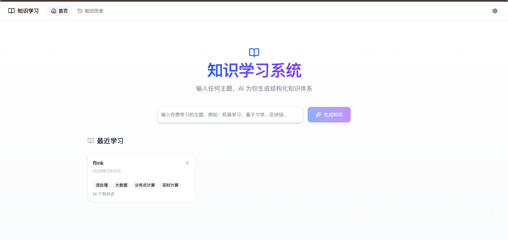
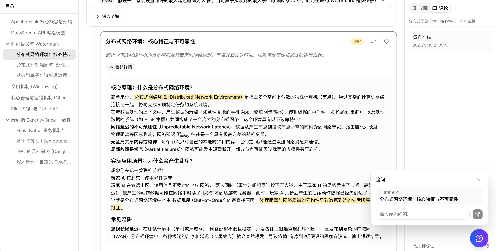
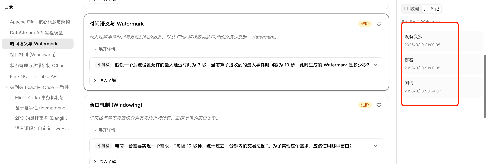

# iStudy — AI 知识学习系统

一个面向学生的 AI 驱动知识学习平台。输入任意主题，AI 自动生成结构化知识点，配备流程图、测验题和卡通配图，支持多级知识展开、收藏和评论。







## 功能特性

- **AI 知识生成** — 输入主题（如"Flink"、"Go"、"Rust"），AI 自动生成结构化知识卡片
- **多级展开** — 每个知识点可"深入了解"，最多支持 3 层递归展开
- **Mermaid 流程图** — 知识点自动附带可视化流程图
- **互动测验** — 每个知识点配有选择题，含提示和解析
- **AI 配图生成** — 一键生成卡通风格教育插图，色彩明快适合学习
- **收藏系统** — 收藏重要知识点，右侧面板快速查看
- **评论功能** — 对知识点添加笔记和评论
- **三栏布局** — 左侧目录导航 + 中间知识卡片 + 右侧收藏/评论面板
- **悬浮球** — 可拖拽的浮动操作按钮，支持边缘吸附

## 技术栈

| 技术 | 版本 | 说明 |
|------|------|------|
| Next.js | 16 | App Router + React 19 |
| TypeScript | 5 | 全项目类型安全 |
| Prisma | 7 | ORM + SQLite 数据库 |
| Tailwind CSS | 4 | 样式框架 |
| Shadcn/ui | base-nova | 组件库 |
| OpenAI SDK | 6 | AI 接口（DeerAPI 兼容） |
| Mermaid.js | 11 | 流程图渲染 |
| KaTeX | - | 数学公式渲染 |

---

## 快速开始（部署指南）

> 即使你是编程新手，也可以按照以下步骤完成部署！

### 前置要求

你需要在电脑上安装以下软件：

1. **Node.js**（v18 或更高版本）
   - 下载地址：https://nodejs.org/
   - 选择 LTS（长期支持）版本，下载安装即可
   - 安装完成后，打开终端验证：
     ```bash
     node -v    # 应显示 v18.x.x 或更高
     npm -v     # 应显示 9.x.x 或更高
     ```

2. **Git**（版本管理工具）
   - 下载地址：https://git-scm.com/downloads
   - macOS 用户可直接在终端输入 `git`，系统会提示安装

### 第一步：下载项目

打开终端（macOS 为 Terminal，Windows 为 PowerShell），执行：

```bash
git clone https://github.com/Becoues/iStudy.git
cd iStudy
```

### 第二步：安装依赖

```bash
npm install
```

> 这一步会下载项目所需的所有依赖包，可能需要 1-3 分钟，请耐心等待。

### 第三步：初始化数据库

```bash
npx prisma migrate dev
```

> 这会自动创建 SQLite 数据库文件（`prisma/dev.db`），无需手动安装数据库软件。

### 第四步：启动项目

```bash
npm run dev
```

启动成功后，终端会显示：

```
▲ Next.js 16.x.x
- Local: http://localhost:3000
```

用浏览器打开 **http://localhost:3000** 即可看到首页。

### 第五步：配置 AI 密钥

1. 点击页面左侧导航栏的 **⚙️ 设置** 按钮
2. 在设置页面填入你的 API Key：
   - **Provider**: DeerAPI（默认）
   - **API Key**: 填入你的 DeerAPI 密钥
   - **Model**: 默认 `gpt-4o`（可选其他模型）
3. 点击 **保存设置**

> 如果你还没有 API Key，可以在 [DeerAPI](https://api.deerapi.com) 注册获取。

### 第六步：开始学习！

回到首页，在输入框中输入你感兴趣的主题（如"Python"、"机器学习"、"React"），点击生成，AI 会自动创建结构化的知识卡片。

---

## 生产环境部署

### 方式一：本地构建

```bash
npm run build    # 构建生产版本
npm run start    # 启动生产服务器（默认端口 3000）
```

### 方式二：Vercel 部署（推荐）

1. 将项目推送到你的 GitHub 仓库
2. 访问 [vercel.com](https://vercel.com)，使用 GitHub 登录
3. 点击 "Import Project"，选择你的仓库
4. Vercel 会自动检测 Next.js 项目并完成部署

> 注意：Vercel 部署需要额外配置数据库（SQLite 不支持 serverless 环境），可考虑使用 Turso 或 PlanetScale 替代。

### 方式三：Docker 部署（最简单）

只需安装 [Docker Desktop](https://www.docker.com/products/docker-desktop/)，然后执行：

```bash
# 构建镜像
docker build -t istudy .

# 运行容器（数据持久化到本地 data 目录）
docker run -d -p 3000:3000 -v ./data:/app/data --name istudy istudy
```

打开 http://localhost:3000 即可使用。

**常用命令：**

```bash
docker stop istudy      # 停止
docker start istudy     # 重新启动
docker rm istudy        # 删除容器
docker logs istudy      # 查看日志
```

> 数据库文件保存在 `./data/` 目录中，删除容器不会丢失数据。

---

## 项目结构

```
src/
├── app/                    # Next.js App Router 页面
│   ├── api/                # API 路由
│   │   ├── knowledge/      # 知识生成/展开/配图 API
│   │   ├── modules/        # 模块 CRUD API
│   │   ├── comments/       # 评论 API
│   │   └── settings/       # 设置 API
│   ├── modules/[id]/       # 模块详情页（三栏布局）
│   └── settings/           # 设置页面
├── components/
│   ├── knowledge/          # 知识相关组件（卡片、目录、测验等）
│   ├── layout/             # 布局组件（导航栏、侧边栏）
│   └── ui/                 # Shadcn/ui 基础组件
├── hooks/                  # 自定义 Hooks（SSE 流式响应等）
├── lib/                    # 工具函数（Prisma、OpenAI、Prompt 等）
└── types/                  # TypeScript 类型定义
```

## 常见问题

**Q: `npx prisma migrate dev` 报错怎么办？**

确保你在项目根目录下执行命令。如果仍有问题，尝试删除 `prisma/dev.db` 后重新执行。

**Q: 页面显示"请先在设置中配置 API Key"？**

进入设置页面配置你的 DeerAPI 密钥，保存后即可正常使用。

**Q: 生成知识点时一直加载？**

检查 API Key 是否正确，以及网络是否可以访问 `api.deerapi.com`。

**Q: 配图生成失败？**

配图功能使用 `gemini-3-pro-image` 模型，确保你的 API Key 支持该模型。单次生成约需 10-20 秒。

---

## License

MIT
