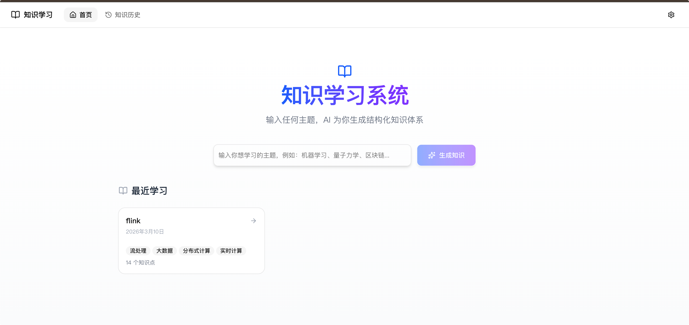
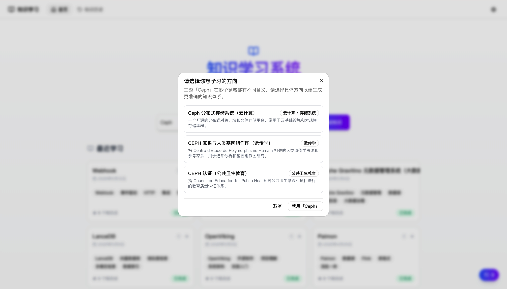
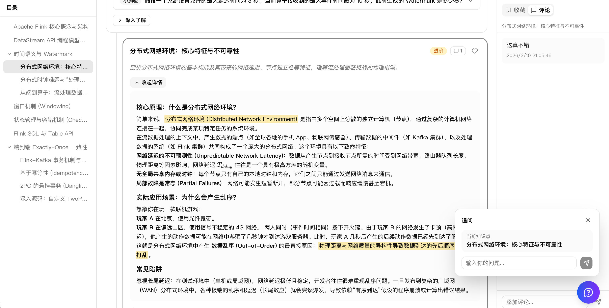
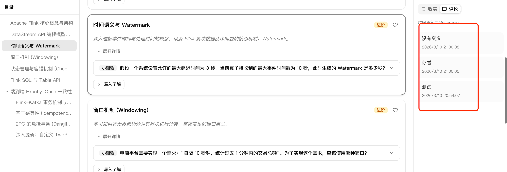

# iStudy - AI 知识学习系统

iStudy 是一个中文优先的 AI 知识学习平台。输入任意主题后，系统会自动识别主题方向、生成结构化知识模块，并围绕每个知识点提供深入讲解、流程图、测验题、参考链接、配图、评论、收藏、聊天追问和 Obsidian 导出。

## 界面预览









## 功能特性

- **同名主题识别** - 生成前自动识别多义词或跨领域主题，例如 Ceph 会提示选择云计算、遗传学或公共卫生方向。
- **并行 AI 知识生成** - 先生成知识大纲，再并发补全详情，保留流式进度反馈和最终稳定顺序。
- **任务队列** - 首页最多 3 个生成任务并行执行，支持取消、重试、刷新后状态恢复和防重复保存。
- **结构化知识卡片** - 每个知识点包含摘要、Markdown 详情、难度、Mermaid 图、测验题和参考链接。
- **递归深入学习** - 对任意知识点继续「深入了解」，最多支持 3 层知识树展开。
- **手动补充节点** - 在知识树中添加自定义知识节点，后续可继续用 AI 展开。
- **模块工作台** - 左侧目录导航、中间知识卡片、右侧收藏/评论/聊天面板，目录和右栏宽度可拖拽调整。
- **模块聊天** - 围绕整个模块或当前知识点提问，可锁定上下文，并把对话凝练为新的知识卡片。
- **收藏与评论** - 收藏关键知识点，给知识点添加、编辑、删除个人笔记和评论。
- **AI 配图管理** - 为知识点生成教育插图，支持隐藏、下载、重新生成和删除。
- **Obsidian 导出** - 支持导出整个模块或单个知识点为 Markdown，可选择携带测验题和 AI 润色。
- **历史记录管理** - 搜索、按标签筛选、排序和删除已生成的学习模块。
- **本地优先存储** - SQLite 保存模块、知识点、评论和设置；生成图片与导出文件保存在本地文件系统。
- **Docker 一键启动** - 提供 `start.sh` 和 `docker compose`，自动处理容器构建、数据挂载和 Obsidian 路径。

## 技术栈

| 技术 | 版本 | 说明 |
|------|------|------|
| Next.js | 16.1 | App Router + React 19 |
| React | 19.2 | 客户端交互与工作台状态 |
| TypeScript | 5 | 全项目类型安全 |
| Prisma | 7.4 | SQLite ORM，生成客户端在 `src/generated/prisma` |
| Tailwind CSS | 4 | 样式框架 |
| Shadcn/ui / Base UI | 4 / 1.2 | 基础组件与弹窗、菜单、表单控件 |
| Zustand | 5 | 本地任务队列和持久化状态 |
| OpenAI SDK | 6.27 | 调用 CometAPI 兼容接口 |
| Mermaid.js | 11.13 | 知识流程图渲染 |
| KaTeX / React Markdown | - | 数学公式、代码高亮和 Markdown 渲染 |

## 快速开始

### 前置要求

1. **Node.js 20.9 或更高版本**

   下载地址：https://nodejs.org/

   ```bash
   node -v
   npm -v
   ```

2. **Git**

   下载地址：https://git-scm.com/downloads

### 1. 下载项目

```bash
git clone https://github.com/Becoues/iStudy.git
cd iStudy
```

### 2. 安装依赖

```bash
npm install
```

### 3. 初始化数据库

```bash
npx prisma migrate dev
```

这会创建 SQLite 数据库文件，默认路径为 `data/istudy.db`。

### 4. 启动开发服务

```bash
npm run dev
```

浏览器打开 http://localhost:3000。

### 5. 配置 AI 和导出路径

点击页面顶部的设置按钮，配置：

- **API 密钥**：CometAPI 接口密钥（https://api.cometapi.com ，以 `sk-` 开头）
- **模型**：默认 `gpt-5.4`
- **生图模型**：默认 `gpt-image-2`
- **Obsidian 导出目录**：默认 `/Users/mac/Documents/Main/AI_talking`

保存后即可开始生成知识模块。

## 生产环境部署

### 本地构建

```bash
npm run build
npm run start
```

### Docker 启动

推荐直接使用启动脚本：

```bash
./start.sh
```

脚本会检查 Docker、自动创建 Obsidian 导出目录、按需重建镜像，并在 http://localhost:3002 启动服务。

也可以手动执行：

```bash
docker compose up -d
docker compose logs -f
docker compose down
```

Docker 会挂载：

- `./data` -> SQLite 数据库
- `./public/images/knowledge` -> AI 生成配图
- Obsidian 导出目录 -> Markdown 文件输出

> 注意：不要同时运行 Docker 服务和 `npm run dev` 访问同一份 SQLite 数据库，避免多进程写入冲突。

### Vercel 部署

Vercel 可以部署 Next.js 应用，但当前项目默认使用本地 SQLite 和本地文件系统。若部署到 serverless 环境，需要替换数据库和文件存储方案，例如 Turso、PostgreSQL、对象存储或持久卷。

## 项目结构

```text
src/
├── app/
│   ├── api/
│   │   ├── knowledge/      # 生成、展开、同名识别、配图 API
│   │   ├── modules/        # 模块与知识点持久化 API
│   │   ├── chat/           # 模块聊天与对话凝练 API
│   │   ├── export/         # Obsidian 导出 API
│   │   ├── comments/       # 评论 API
│   │   └── settings/       # 设置 API
│   ├── history/            # 历史记录页
│   └── modules/[id]/       # 模块学习工作台
├── components/
│   ├── chat/               # 模块聊天与凝练预览
│   ├── knowledge/          # 知识卡片、目录、测验、导出、节点管理
│   ├── layout/             # 顶部导航、侧边栏、右侧面板
│   ├── settings/           # 设置弹窗
│   ├── task/               # 任务队列悬浮入口与面板
│   └── ui/                 # 通用 UI 组件
├── hooks/                  # 收藏、聊天、任务队列、流式响应 hooks
├── lib/                    # Prompt、解析、任务 store、Prisma、工具函数
├── generated/prisma/       # Prisma 生成客户端
└── types/                  # 知识模块类型定义
```

## 常见问题

**Q: `npm run dev` 或 `npm run build` 报 Node 版本错误？**

请升级到 Node.js 20.9 或更高版本。

**Q: 页面提示需要配置 API Key？**

打开设置弹窗，填入 CometAPI 密钥并保存。

**Q: 生成任务刷新后中断了怎么办？**

任务队列会把刷新时正在运行的任务标记为失败，可在任务面板中重试。

**Q: 生成知识点时一直加载或失败？**

检查 API Key、模型名称、网络连接和 CometAPI 账户额度。满载时首页 3 个生成任务会触发更多并发上游请求，可能受到服务商限流影响。

**Q: Obsidian 导出失败？**

确认设置中的导出目录存在且当前用户有写入权限。Docker 模式下请确认该目录已正确挂载。

**Q: 配图生成失败？**

确认设置中的生图模型可用，且 API Key 支持对应模型。生成图片会写入 `public/images/knowledge/`。

## License

MIT
